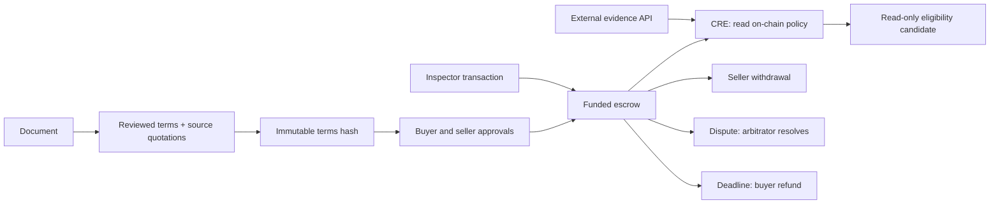

# Architecture and trust boundaries

## Implemented flow

1. Read a synthetic document and manually populate a strict terms specification.
2. Check the exact document hash and that required clause quotations occur in its text.
3. Commit the canonical specification hash to one immutable escrow deployment.
4. Buyer and seller each approve that hash; buyer deposits the exact amount.
5. Independently, CRE reads the contract policy and an HTTP evidence record, evaluates time/version/asset/state and emits a candidate.
6. A designated inspector can submit an acceptance transaction directly to the escrow. This is a separate trust path, not a CRE report.
7. A funded agreement can instead be disputed by either party. An arbitrator chooses full payment or full refund. With no dispute or acceptance, the buyer can refund after the deadline.

## What a commitment proves

`documentHash` commits to exact UTF-8 document text; changing whitespace also changes it. `termsHash` commits to a sorted-key canonical JSON specification including the document hash, chain ID, roles, amount, asset serial, times and source quotations. It is project-specific canonicalization, not a claim of compliance with an external serialization standard.

Source quotations establish text provenance only. They do not prove that every clause was captured, that values were interpreted correctly, or that the document is valid or enforceable. Review must compare the full source and all extracted values.

## Trust and limits

- The inspector signer is trusted to establish acceptance. A hash alone cannot prove the condition of physical equipment.
- HTTP evidence is deliberately unsigned and synthetic. CRE labels its result unauthenticated and never authorizes a transfer. Identical response consensus does not make an untrusted source true.
- The fixed contract guards roles, amounts, times and state. It cannot establish legal ownership or guarantee legal remedies.
- Terms are immutable. Amendments require a new agreement and a separately agreed migration/cancellation process; that process is not implemented.
- A dispute must be mined before acceptance. This version has no cooling-off or objection window after acceptance; transaction ordering matters. Already settled withdrawals cannot be reversed.
- Arbitration supports only full release or full refund. If the arbitrator never acts, disputed funds remain locked. No partial performance or arbitrator replacement is implemented.
- Local CRE reads the latest block. Public-chain use needs finality handling, deployment validation and authenticated reports with chain/address/nonce/expiry bindings.
- No real funds should be entrusted to this unaudited prototype. The supplied commands operate on synthetic balances only.
- Do not publish real documents or personal data to a chain. This fixture contains neither.

## Intended document assistance

A future model proposes a typed specification with clause references and unresolved ambiguities. A human reviews it, then each party signs the exact commitment. The model must not invent missing terms, generate arbitrary executable Solidity, sign transactions or attest real-world events. Begin with one contract type and one jurisdiction-specific review process.
